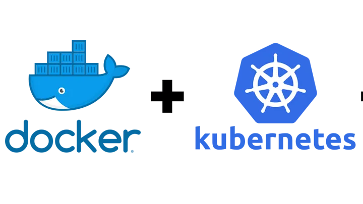

## Docker fundamentals

- [Docker notes](pages/Docker%20notes.md)j
- [Docker - Core concepts](pages/Docker%20-%20Core%20concepts/Docker%20-%20Core%20concepts.md)
- [Docker - Core terminal commands](pages/Docker%20-%20Core%20terminal%20commands.md)
- [Introduction to Volumes](pages/Introduction%20to%20Volumes/Introduction%20to%20Volumes.md)
- [Network on docker](pages/Network%20on%20docker/Network%20on%20docker.md)
- [Utility containers](pages/Utility%20containers/Utility%20containers.md)
- [Docker compose](pages/Docker%20compose.md)

## Manager Docker on AWS ecosystem

- [Deploying Docker Containers on AWS](pages/Deploying%20Docker%20Containers%20on%20AWS.md)
- [First project deploy](pages/First%20project%20deploy/First%20project%20deploy.md)
- [AWS ECS](pages/AWS%20ECS/AWS%20ECS.md)

## Kubernetes

- [Kubernetes](pages/Kubernetes/Kubernetes.md)