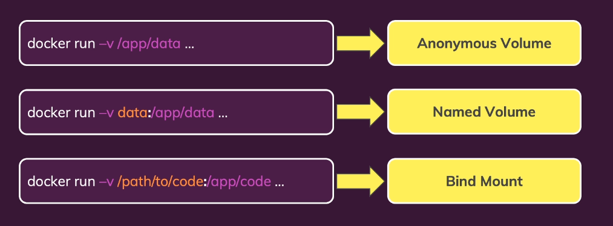

**Volumes** are folders on your host machine's hard drive which are mounted (”made available”, mapped) into containers. The difference when we use volumes that is the data inside the volume persists even container shuts down.

  

Named volumes are great for data that should be persistent but which you don’t need to edit directly.

  

- To create a volume to the container, you need to add this syntax below

```JavaScript
-v <some-name>:<path-of-volume>
```

  

- If you add `docker volume ls`, you can see this:

![[Untitled 1.png]]

  

```JavaScript
-v $(pwd):/app  // use this on Linux or mac
-v "%%cd":/app // use this on windows
```

  

### Example how to add volume to a specific app

  

```JavaScript
docker run --name feedback-app --rm -d -p 3001:80 -v feedback:/app/feedback -v $(pwd):/app -v /app/node_modules feedback-node:volumes
```

  

The image `feedback-node:volumes` have a workdir as `/app`

- The volume that maintains new files of this application is named `feedback:/app/feedback`
- To copy all files based on your current application, we use the `$(pwd):/app`

  

> [!important]  
> But when we add this, this command overwritten all files created in this path, even if we create these files on your image. If you try to run this, the application instantly breaks because the container doesn’t find node_modules to import the libraries. This happens because this example runs a node app.To fix that we need to add another volume specifying that node modules can’t be overwritten.  

  

Now add `-v /app/node_modules` to fix that!!

  
