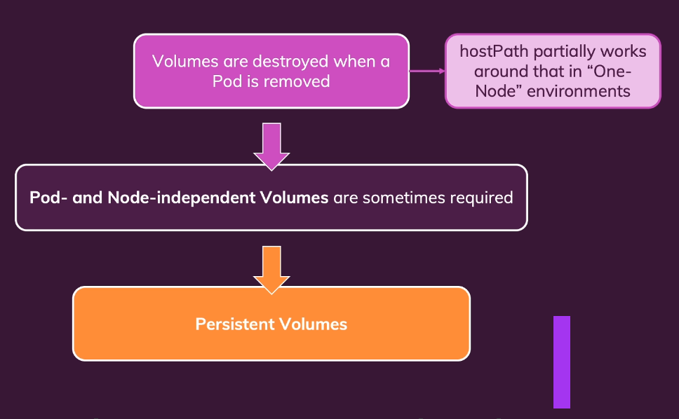

Kubernetes has your own volume system, check out keys differences


Here is a example about how create a volume inside of Pod

```yaml
spec:
  containers:
	name: story
	image: your-dockerimage
	volumeMounts:
		- mountPath: /app/story
		name: story-volume
  volumes:
	- name: story-volume
	  empyDir: {}
```

You can add volumes with controlled path access

```yml
volumes:
	- name: story-volume
	hostPath:
		path: /data
		type: DirectoryOrCreate
```

### Persistent Volumes
---



